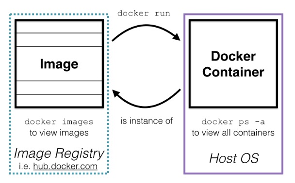
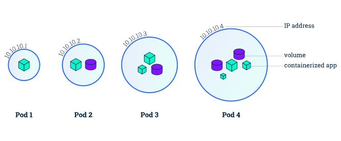
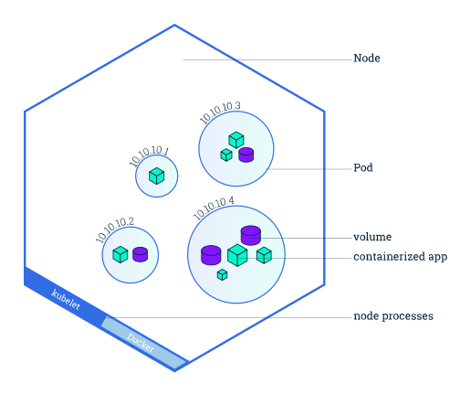
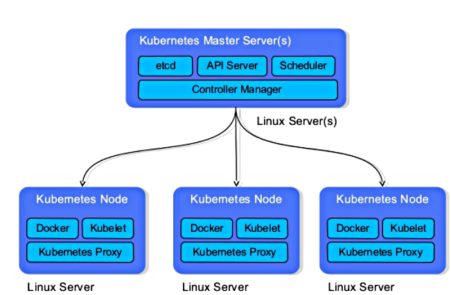
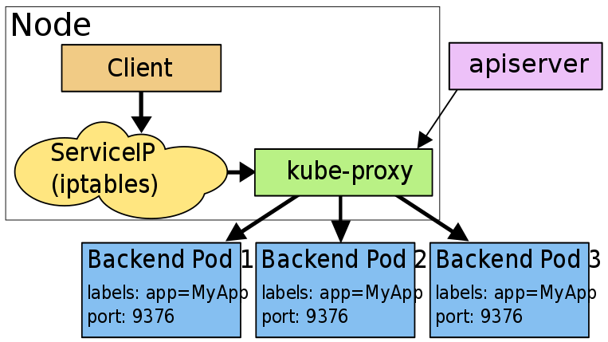
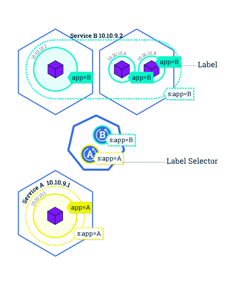
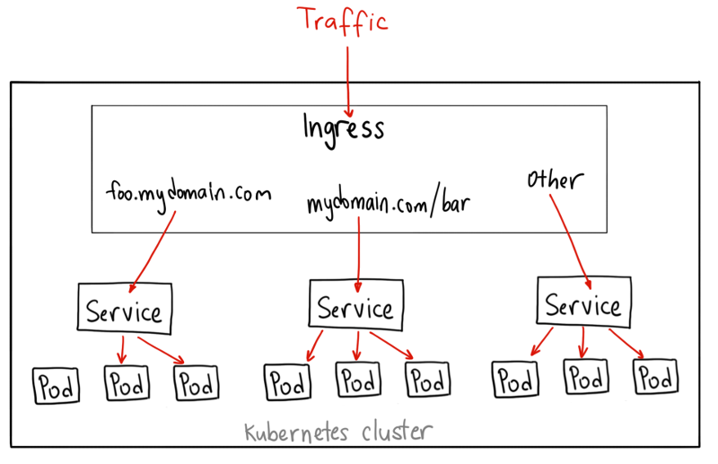
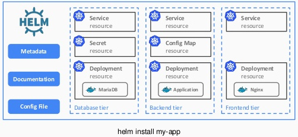

import { Head } from 'mdx-deck'

export { default as theme } from './theme'

<Head>
  <title>CI/Kubernetes</title>
</Head>

# CI/Kubernetes

---

## Kubernetes concepts

---

### Docker image


```notes
- image is an archive of OS files + App files
```

---

### Docker container



```notes
- container mount image & launch a process
```

---

### Kubernetes pod



```notes
- pod is one or mode container + filesystem + network
- pod ~ VM abstraction in k8s
- pods can communicate through localhost
- pods lifetimes should be linked, eg app + log manager
- pod has one IP on k8s virtual network
- pods cannot bind the same port
---

### Kubernetes node



```notes
- node is a machine where k8s runs pods
- node runs kubelet + docker
- node uses docker engine to run containers
- we have only 1 node now
```

---

### Kubernetes cluster



```notes
- cluster = 1+ nodes & 1+ masters
- masters runs k8s rest API + config DB + controller
- users/services use API to create resources
- resources are stored in config DB
- controller periodically watch config and asks node to schedule resources
- we have 1 master now
---

### Kubernetes deployment


```notes
- pods are deployed by a deployment resource
- deployment specify # and type of pods to run
- k8s uses labels to find/match pods
- deployment can specify scaling/restarting rules
```

---

### Kubernetes service



```notes
- services expose pods ports on k8s network
- loadbalancer
- DNS : other pods can access a service by name
- clusterPort : internal to k8s VN
- nodePort : expose port on (all) node machines
```

---



---

### Kubernetes ingress



```notes
- ingress is a reverse proxy (our version uses nginx
- can redirect to k8s services by domains/subpath
- ingress controller combines all ingress rules into one nginx config
- we can add/remove rules independantly
```

---

### Helm charts

Helm = k8s package manager



```notes
- creating all resource for an app is complicated
- helm is a package manager installable in k8s
- we can install helm charts = app resources templates
- I used this for minitoring tools
```

---

### Others

- ConfigMap
- Secrets
- Persistent Volumes
- Persistent Volumes Claims

---

## CI pipeline

---

### Build step


---

### Publish step


---

### Deploy step


---

### Example .gitlab-ci.yml

```yaml
build:
  script:
    - docker build -t admin:master .

publish:
  script:
    - docker tag admin:master 127.0.0.1:500/admin:master
    - ssh -L 5000:kube-node:5000 docker push 127.0.0.1:5000/admin:master

deploy:
  script:
    - cat deploy.yml | envsubst | kubectl apply -f -
```

```notes
- docker registry is only accessible from gitlab-runner
- it serves http -> we can't access it directly
- we must port-forwar the remote registry port to the local machine, to push image
- I hope to configure https/authent on docker registry soon (with let's encrypt)
- envsubst allows to inject env vars in deployment config
- eg. name of current branch to automatically deploy one version of the app / CI branch !
```

---

### Example deployment

```yaml
apiVersion: apps/v1beta2
kind: Deployment
metadata:
  name: mon-compte-admindb
  labels:
    app: mon-compte
    component: admindb
spec:
  selector:
    matchLabels:
      app: mon-compte
      component: admindb
  strategy:
    type: Recreate
  template:
    metadata:
      labels:
        app: mon-compte
        component: admindb
    spec:
      containers:
      - name: mon-compte-admindb
        image: mongo
        ports:
        - containerPort: 27017
```

```notes
- deployment find/manage pods by matching labels
```

---

### Example service

```yaml
apiVersion: v1
kind: Service
metadata:
  name: mon-compte-admindb
  labels:
    app: mon-compte
    component: admindb
spec:
  ports:
  - port: 27017
    protocol: TCP
  selector:
    app: mon-compte
    component: admindb
```


```notes
- service find/manage pods by matching labels
- clusterPort is used only for DNS access in other pods
- nodePort expose service on node machine
```

---

### Example ingress

`http://k8s.amaris.ovh:30080`

```yaml
apiVersion: extensions/v1beta1
kind: Ingress
metadata:
  name: mon-compte-admin
  labels:
    app: mon-compte
    component: admin
  annotations:
    kubernetes.io/ingress.class: "nginx"
spec:
  rules:
  - http:
      paths:
      - path: /mon-compte-admin
        backend:
          serviceName: mon-compte-admin
          servicePort: 3000
```

```notes
- ingress access is restricted to Amaris public IP
```

---

## Dev access

---


---

- Install [Kubectl](https://kubernetes.io/docs/tasks/tools/install-kubectl/)
- get config `~/.kube/config` (ask me)

```notes
- config contains credentials so should be protected
```

---

### Kubectl basics

`kubectl [get|describe|delete|edit] <resourceType> [name]`

---

### List pods

```bash
$ kubectl get pods
NAME                                            READY     STATUS    RESTARTS   AGE
echoserver-9f757789d-x5mq7                      1/1       Running   2          16d
mon-compte-admin-master-b9bcfb5c8-rj8hg         1/1       Running   0          19h
mon-compte-admin-proxy-master-58fd5666d-f87vf   1/1       Running   0          2d
mon-compte-admindb-master-8689fbc6cb-jt54h      1/1       Running   1          14d
mon-compte-connector-clj-75b56fdf89-h5k5w       1/1       Running   0          1d
mon-compte-connector-master-7b9b8c64d5-c6tnr    1/1       Running   0          17h
mon-compte-ldap1-595db45557-mt76n               1/1       Running   0          17h
mon-compte-ldap2-55f9c996f5-vfplq               1/1       Running   0          17h
```

```notes
- verify STATUS=Running
```

---

### Describe pods

```bash
$ kubectl describe pods echoserver-9f757789d-qts8g
Name:               echoserver-9f757789d-qts8g
Node:               dev-kubernetestest-node/145.239.59.100
Start Time:         Thu, 13 Sep 2018 12:15:17 +0200
Labels:             app=echoserver
                    pod-template-hash=593133458
Status:             Running
...
Events:
  Type    Reason     Age   From                              Message
  ----    ------     ----  ----                              -------
  Normal  Scheduled  1m    default-scheduler                 Successfully assigned default/echoserver-9f757789d-qts8g to dev-kubernetestest-node
  Normal  Pulling    43s   kubelet, dev-kubernetestest-node  pulling image "gcr.io/google_containers/echoserver:1.0"
  Normal  Pulled     41s   kubelet, dev-kubernetestest-node  Successfully pulled image "gcr.io/google_containers/echoserver:1.0"
  Normal  Created    39s   kubelet, dev-kubernetestest-node  Created container
  Normal  Started    38s   kubelet, dev-kubernetestest-node  Started container
```

```notes
- see Events to know why a pod is not starting correctly
- check labels if service/deployment does not match pod
```

---

### See pod logs

```bash
kubectl logs mon-compte-admin-master-b9bcfb5c8-rj8hg
...
{"level":30,"time":1536762190030,"msg":"App starting with config","pid":23...}
...
```

---

### Delete pod

(force re-deployment)

```bash
$ kubectl delete pods echoserver-9f757789d-x5mq7
pod "echoserver-9f757789d-x5mq7" deleted
```

---

```notes
- deployment constantly check that correct # of pods are running
- so simply delete a pod to create a new one !
```

### List services

```bash
$ kubectl get services
NAME                             TYPE        CLUSTER-IP       EXTERNAL-IP   PORT(S)          AGE
echoserver                       ClusterIP   10.108.242.133   <none>        80/TCP           16d
kubernetes                       ClusterIP   10.96.0.1        <none>        443/TCP          16d
mon-compte-admin-master          ClusterIP   10.101.45.223    <none>        3000/TCP         15d
mon-compte-admin-proxy-master    NodePort    10.96.76.162     <none>        443:30444/TCP    12d
mon-compte-admindb-master        ClusterIP   10.97.134.211    <none>        27017/TCP        14d
mon-compte-connector-clj         ClusterIP   10.101.184.190   <none>        8080/TCP         2d
mon-compte-connector-clj-https   NodePort    10.104.98.170    <none>        3443:30446/TCP   1d
mon-compte-connector-master      NodePort    10.102.79.5      <none>        7843:30445/TCP   8d
mon-compte-ldap1                 ClusterIP   10.101.53.90     <none>        636/TCP          9d
mon-compte-ldap2                 ClusterIP   10.107.87.243    <none>        636/TCP          9d
```

```notes
- simply see all services names (for DNS) and ports on VN / ports on machine
```

---

### Describe services

```bash
$ kubectl describe services mon-compte-admin-master
Name:              mon-compte-admin-master
Selector:          app=mon-compte,branch=master,component=admin
Type:              ClusterIP
IP:                10.101.45.223
Port:              <unset>  3000/TCP
TargetPort:        3000/TCP
Endpoints:         192.168.57.83:3000
```

```notes
- check that Endpoints is not nil == services matches pods by label
```

---

### Forward service/port on local machine

```bash
$ kubectl port-forward grafana-8f754d4d-nqd9v 4445:3000
Forwarding from 127.0.0.1:4445 -> 3000
Forwarding from [::1]:4445 -> 3000
```

```notes
- find service/pod name with kubectl get services/pods
- find port with kubectl get services
```

---

### Get shell access in container

```bash
$ kubectl exec -it grafana-8f754d4d-nqd9v sh
#
```

---

### List ingress rules

```bash
$ kubectl get ingress
NAME                       HOSTS     ADDRESS   PORTS     AGE
echoserver                 *                   80        16d
mon-compte-admin-master    *                   80        15d
mon-compte-connector-clj   *                   80        2d
```

---

### Describe ingress rule

```bash
$ kubectl describe ingress mon-compte-admin-master
Name:             mon-compte-admin-master
Namespace:        default
Default backend:  default-http-backend:80 (<none>)
Rules:
  Host  Path  Backends
  ----  ----  --------
  *     
        /mon-compte-admin/master   mon-compte-admin-master:3000 (<none>)
```

---

[Kubectl Cheatsheet](https://kubernetes.io/docs/reference/kubectl/cheatsheet/)

---

## k8s: 1st feedback

Pros:
- declarative, good for CI
- nice errors/diagnostics
- good tools
- stable

Cons:
- lots of concepts
- lots of knowledge requirements
- hard to setup
- evolving fast

```notes
- declarative API -> we can define the app + all resources as one file in Git
- tools like kubectl work well and the error messages are good, with specific illegal properties etc
- no crash since setup
- lots of concepts to integrate at beginning (pod/service/deployment/...)
- lots of knowledge to understand how/what to do
- setup doc is hard - kubeadmin is beta and works good though
- api/good practices are evolving fast, some tutorials are out of date
```
