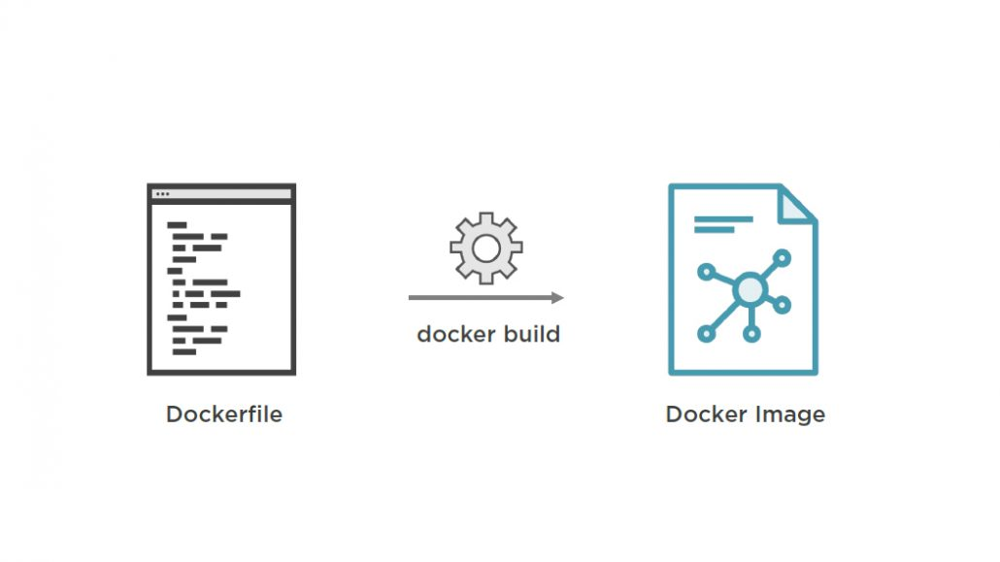

import { Head } from 'mdx-deck'

export { default as theme } from './theme'

<Head>
  <title>CI/Kubernetes</title>
</Head>

# CI/Kubernetes

---

## Kubernetes concepts

---

### Docker image

---

### Docker container

---

### Kubernetes pod

---

### Kubernetes node

---

### Kubernetes cluster

